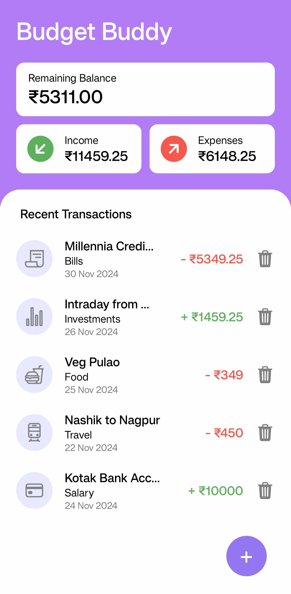

# Budget Buddy 💰

A simple and intuitive expense tracker app built with React Native. Manage your finances with ease by tracking your income, expenses, and overall balance. 

---

## Features 🚀
- Add income and expense transactions.
- Categorize transactions for better tracking.
- View total balance, income, and expenses.
- Delete transactions easily.
- Persistent storage with `AsyncStorage`.

---

## Screenshots 📸

### Home Screen


### Add Transaction


### Transactions List


---

## Tech Stack 🛠️
- **Framework**: React Native
- **Storage**: AsyncStorage
- **Icons**: React Native Vector Icons

---

## Installation 🖥️

1. Clone the repository:
   ```bash
   git clone https://github.com/mayurhedaoo100/BudgetBuddy.git

2. Navigate to the project directory:
   ```bash
   cd BudgetBuddy

3. Install dependencies:
   ```bash
   npm install

4. Start the development server:
   ```bash
   npx expo start

---

## Contributing 🤝

Feel free to contribute to the project by submitting issues or creating pull requests. Let's make Budget Buddy even better!

---

## License 📄

This project is licensed under the MIT License. See the LICENSE file for details.

---

## Author 👤

Developed with ❤️ by Mayur Hedaoo.
